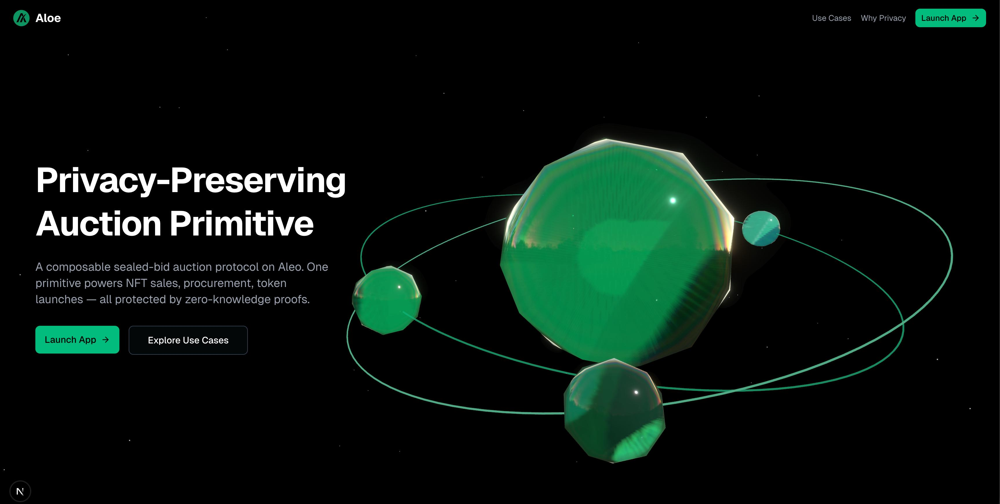

# Aloe
### A Composable, Privacy-Preserving Auction Primitive on Aleo

**Status:** Alpha / Active Development
**Hackathon:** Aleo x AKINDO Privacy Buildathon 2026

  

---

## Overview

**Aloe** is a composable, privacy-preserving sealed-bid auction primitive built on Aleo. The core is a standalone Leo program that handles the commit-reveal scheme, BHP256 commitments, credit escrow, and phase enforcement. Other Leo programs can `import aloe_auction.aleo` and call its transitions directly — no need to reimplement the auction logic.

Bidder identities and bid amounts stay completely hidden until a designated reveal phase. Deposits use `credits.aleo/transfer_private_to_public`, which hides the sender address on-chain. This makes sealed-bid auctions work the way they're supposed to — something transparent blockchains cannot do.

The reference frontend in this repo is one interface on top of the primitive. The same contract can serve different use cases (NFT sales, procurement, token launches) through different frontends, or be composed into other on-chain programs.



### How It Works

```
1. COMMIT     Bidder hashes (amount + salt + auction_id) with BHP256
              Deposits credits via transfer_private_to_public (hides sender)
              On-chain: only the hash and a deposit arriving at the program are visible
              Nobody — not even the auctioneer — can see the bid amount or who sent it

2. REVEAL     After commit deadline, bidders submit their original amount + salt
              Contract re-hashes and verifies the result matches the stored commitment
              Highest verified bid becomes the winner

3. SETTLE     Anyone can trigger settlement after the reveal deadline
              Winning bid amount is transferred to the auctioneer
              Losers reclaim their full deposit. Unrevealed bids forfeit deposits.
```

### Why This Only Works on Aleo

The privacy isn't simulated — it's enforced at the protocol level via zero-knowledge proofs. During the commit phase:

- **Bidder addresses are invisible.** `transfer_private_to_public` consumes a private credits record. The on-chain trace shows credits arriving at the program address, but not who sent them.
- **Bid amounts are hidden.** Only a BHP256 hash of `(amount, salt, auction_id)` is stored on-chain. The preimage is never revealed until the bidder chooses to.
- **Bids cannot be linked.** Multiple bids from the same address are uncorrelatable during the commit phase.
- **Composable privacy.** When another Leo program imports Aloe, the privacy guarantees carry through. Aleo's execution model preserves them across program boundaries.

Sealed-bid auction theory (truthful bidding, no winner's curse, no front-running) requires that bids are genuinely hidden. On transparent chains this doesn't hold. On Aleo with Aloe, it does.

---

## What's Built (Wave 2 — Complete)

The full auction lifecycle is implemented and verified on Aleo testnet with real transactions.

### Smart Contract: `aloe_auction_v4.aleo`

| Transition | What It Does |
| :--- | :--- |
| `create_auction` | Creates an auction with commit/reveal deadlines set from `block.height + duration` |
| `place_bid` | Accepts a private `credits.aleo/credits` record. Locks deposit via `transfer_private_to_public`. Returns a `BidCommitment` record with the BHP256 hash. |
| `reveal_bid` | Bidder submits `(amount, salt)`. Contract re-hashes and verifies against stored commitment. Updates `highest_bid` / `highest_bidder` if this is the leading bid. |
| `settle_auction` | Callable by anyone after reveal deadline. Transfers winning bid to auctioneer via `credits.aleo/transfer_public`. |
| `claim_refund` | Non-winners reclaim deposits. Contract verifies auction is settled, caller is not the winner, and refund hasn't been claimed. |
| `cancel_auction` | Auctioneer cancels if zero bids received. |

**On-chain mappings:** `auctions`, `bid_count`, `revealed_count`, `highest_bid`, `highest_bidder`, `has_revealed`, `revealed_deposits`, `revealed_bidder`, `refund_claimed`

### Frontend

| Feature | Details |
| :--- | :--- |
| **Auction Creation** | Set item name, minimum bid, commit duration, reveal duration. Transaction submitted via wallet adapter. |
| **Sealed Bidding** | Enter bid amount → app generates random salt → computes BHP256 commitment → finds a private credits record → submits transaction. Salt stored in localStorage for reveal. |
| **Phase-Aware UI** | Auction cards show real-time phase (Accepting Bids → Reveal Phase → Ended) using on-chain `commit_deadline` and `reveal_deadline` fetched from Aleo API. |
| **Bid Indicators** | Cards show "Bid Placed" (green), "Reveal Required" (pulsing amber), or "Bid Forfeited" (red) based on your bid status and current phase. |
| **Reveal Dialog** | Auto-recovers salt from localStorage. Shows live on-chain timing. Pre-flight check prevents submitting if outside the reveal window. |
| **Settlement** | One-click settle after reveal deadline. Pre-flight check verifies eligibility before submitting. |
| **Refunds** | Non-winners click "Claim Refund" to reclaim deposits. Contract enforces all eligibility checks. |
| **Shield Credits** | "Shield Credits" button in wallet dropdown converts public credits to private records needed for bidding. |

### Credits Flow

```
COMMIT PHASE:
  Bidder's private credits record  ──[transfer_private_to_public]──►  Program public balance
  (sender hidden)                                                      (deposit locked)

SETTLEMENT:
  Program public balance  ──[transfer_public]──►  Auctioneer address
  (winning bid amount)                              (payment received)

REFUND:
  Program public balance  ──[transfer_public]──►  Bidder address
  (deposit amount)                                  (refund received)
```

---

## Architecture

Aloe is split into two layers: the **on-chain primitive** (a standalone Leo program) and a **reference frontend** (Next.js). They're intentionally decoupled — the contract doesn't know or care about the frontend. Any program or UI can interact with it.

```
┌──────────────────────────────────────────────────────────────────────┐
│  ON-CHAIN PRIMITIVE (Leo)                                            │
│                                                                      │
│  aloe_auction_v4.aleo                                                │
│  ├── imports credits.aleo                                            │
│  ├── BHP256 commit-reveal scheme                                     │
│  ├── transfer_private_to_public (private deposits)                   │
│  ├── Block-height-based phase enforcement                            │
│  └── Clean transition interface:                                     │
│       create_auction · place_bid · reveal_bid                        │
│       settle_auction · claim_refund · cancel_auction                 │
│                                                                      │
│  ▲ Any Leo program can: import aloe_auction_v4.aleo                  │
│  │ and call these transitions directly                               │
├──────────────────────────────────────────────────────────────────────┤
│  REFERENCE FRONTEND (Next.js)                                        │
│                                                                      │
│  ├── pages/          Dashboard, Auctions, Create                     │
│  ├── components/     AuctionCard, RevealBidDialog,                   │
│  │                   SettleAuctionButton, ClaimRefundButton,          │
│  │                   AuctionDetailDialog, AuctionTimer, ...           │
│  ├── lib/aleo.js     Transaction builders, on-chain fetching         │
│  ├── store/          Zustand state (auctions, loading flags)         │
│  └── hooks/          useBlockHeight (polls every ~3s)                │
│                                                                      │
│  Wallet Layer: @provablehq adapters (Leo Wallet + Shield)            │
│  Network: Aleo Testnet (ZK proof generation + on-chain state)        │
└──────────────────────────────────────────────────────────────────────┘
```

### Composability Example (Future — Wave 5)

```leo
// Another developer's NFT marketplace program
import aloe_auction_v4.aleo;

program my_nft_marketplace.aleo {
    // Start a private auction for an NFT
    async transition list_nft(nft_id: field, min_price: u64) -> Future {
        // Aloe handles the entire auction lifecycle
        let future: Future = aloe_auction_v4.aleo/create_auction(...);
        return future;
    }
}
```

### Tech Stack

| Layer | Technology |
| :--- | :--- |
| Smart Contract | [Leo Language](https://leo-lang.org/) on Aleo |
| Frontend | Next.js 16, React, TailwindCSS, shadcn/ui |
| State | Zustand |
| Wallets | Leo Wallet + Shield Wallet via `@provablehq` adapters |
| Icons | Lucide React |
| Animations | Framer Motion |

---

## Getting Started

### Prerequisites

1. **Aleo Wallet:** Install [Leo Wallet](https://www.leo.app/) or Shield Wallet browser extension.
2. **Testnet Credits:** Get credits from the [Aleo faucet](https://faucet.aleo.org/).
3. **Node.js:** v18 or later.

### Installation

```bash
git clone https://github.com/ALOELOELOE/Aloe.git
cd Aloe
npm install
npm run dev
```

Open [http://localhost:3000](http://localhost:3000)

### Quick Start

1. Connect your wallet (top right)
2. **Shield credits** — click the Shield button in the wallet dropdown to convert public credits to private records (required for bidding)
3. **Create an auction** — go to Create, set item name + minimum bid + durations
4. **Place a bid** — click an auction card, enter your bid amount, confirm the transaction
5. **Reveal your bid** — when the card shows "Reveal Required", click to reveal
6. **Settle** — after reveal phase ends, click "Settle Auction"
7. **Claim refund** — if you lost, click "Claim Refund" to get your deposit back

---

## Buildathon Requirements

### Shield Wallet Integration

Aloe supports **Shield Wallet** via `@provablehq/aleo-wallet-adaptor-shield`. The wallet adapter stack uses `@provablehq` packages for both Leo and Shield wallet support, fulfilling the buildathon's wallet integration requirement.

### credits.aleo Integration

All value transfers go through Aleo's native `credits.aleo` program:

- **Deposits:** `credits.aleo/transfer_private_to_public` — locks credits in the program's public balance while hiding the sender
- **Settlement:** `credits.aleo/transfer_public` — sends winning bid to auctioneer
- **Refunds:** `credits.aleo/transfer_public` — returns deposits to losing bidders

No mock tokens. Real testnet credits locked, transferred, and refunded.

### Deployed Program

- **Program ID:** `aloe_auction_v4.aleo`
- **Network:** Aleo Testnet

---

## User Flow

```
┌─────────────┐     ┌─────────────┐     ┌─────────────┐     ┌─────────────┐     ┌─────────────┐
│   Connect   │────▶│   Create    │────▶│  Place Bid  │────▶│  Reveal Bid │────▶│   Settle    │
│   Wallet    │     │   Auction   │     │  (sealed)   │     │  (verify)   │     │  + Refund   │
└─────────────┘     └─────────────┘     └─────────────┘     └─────────────┘     └─────────────┘
                                              │                    │
                                              ▼                    ▼
                                        BHP256 hash          Contract re-hashes
                                        stored on-chain      and verifies match
                                        Deposit locked       Updates highest bid
                                        Sender hidden        if new leader
```

1. **Connect Wallet** — Leo Wallet or Shield Wallet.
2. **Shield Credits** — Convert public credits to private records (one-time, reusable across auctions).
3. **Create Auction** — Set item details, minimum bid, commit and reveal durations (in blocks).
4. **Place Bid** — Enter amount. App generates random salt, computes `BHP256(amount, salt, auction_id)`, finds a private credits record, and submits the transaction. Salt saved in localStorage.
5. **Wait for Reveal Phase** — Countdown timer shows blocks remaining. Card badge updates in real-time.
6. **Reveal Bid** — Salt auto-recovered. Contract verifies the hash. If your bid is highest, you become the leader.
7. **Settlement** — After reveal deadline, anyone clicks "Settle". Winner announced. Auctioneer receives payment.
8. **Claim Refund** — Losers click "Claim Refund" to reclaim their deposit.

---

## Roadmap

**Phase 1 — Core Primitive** (Waves 1–2)
- [x] **Wave 1:** Core Leo program (`create_auction`, `place_bid`) + basic frontend
- [x] **Wave 2:** Privacy fix (`transfer_private_to_public`) + full lifecycle (reveal, settle, refund, cancel)

**Phase 2 — Auction Types** (Waves 3–4)
- [ ] **Wave 3:** Vickrey (second-price) auctions — winner pays 2nd-highest bid
- [ ] **Wave 4:** Dutch (descending-price) auctions + on-chain mapping reader

**Phase 3 — Composability & Skins** (Waves 5–6)
- [ ] **Wave 5:** Importable primitive + demo wrapper program (proof that other Leo programs can embed Aloe)
- [ ] **Wave 6:** Multiple frontend skins — NFT auctions, procurement/RFQ — same contract, different UIs

**Phase 4 — Full Suite** (Waves 7–8)
- [ ] **Wave 7:** Reverse + Batch auction types
- [ ] **Wave 8:** Advanced privacy (deposit obfuscation) + JS SDK (`aloe-sdk`) for third-party integrations

**Phase 5 — Production** (Waves 9–10)
- [ ] **Wave 9:** Security audit + production hardening
- [ ] **Wave 10:** Mainnet deployment + analytics dashboard

---

## Known Limitations

- **Deposit visibility:** Deposit amount is public and currently equals the bid amount. Observers can infer bids from deposit sizes. Future fix: deposit tiers or obfuscation.
- **Single-browser salt:** Bid salt is stored in localStorage. Must reveal from the same browser where you bid.
- **Last-second bids:** Contract checks `block.height` at finalization, not submission. Bids placed in the last ~20 seconds may be rejected.

---

## Disclaimer

This project is in **Alpha**. The smart contracts have not been audited. Use at your own risk. Testnet only.

---

*Built for the Aleo x AKINDO Privacy Buildathon 2026*
